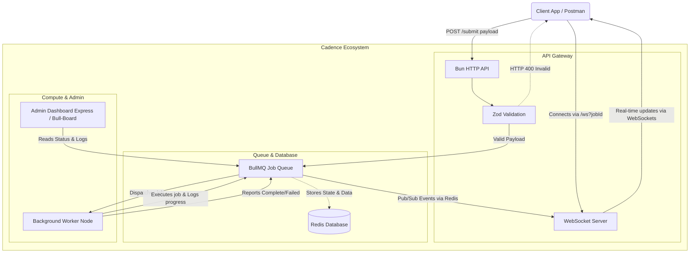

a distributed, high-performance background job processing system built with **Bun**, **Redis**, and **BullMQ**. It is designed to decouple heavy, long-running tasks from your main application by offloading them to scalable background workers.

## 🌟 What it does

1. **Producer (API)**: Exposes a `/submit` endpoint to accept strict, Zod-validated JSON payloads. It pushes these tasks safely onto a Redis queue.
2. **Consumer (Worker)**: A decoupled background process that constantly listens to the queue, executes the heavy work based on job types, and handles automated retries and exponential backoffs.
3. **Admin Dashboard**: A secure Express-based GUI to visually orchestrate queues, view payloads, and manage stalled jobs.
4. **Real-time Feedback**: Streams job completion and failure events directly back to clients via live WebSockets.

---

## 🏗 Architecture Diagram



---

## 🛠 Tech Stack

- **Runtime**: [Bun](https://bun.sh/) (for the API and Worker) / Node.js
- **Queue Engine**: [BullMQ](https://docs.bullmq.io/)
- **Database**: [Redis](https://redis.io/)
- **Validation**: [Zod](https://zod.dev/)
- **Web Frameworks**: `Bun.serve` (API) & [Express.js](https://expressjs.com/) (Dashboard)
- **Monitoring UI**: [@bull-board](https://github.com/felixmosh/bull-board)
- **Language**: TypeScript (Strict typing with `z.infer`)

---

## 📂 Folder Structure

```text
cadence/
├── .env                 # Environment variables configuration
├── api/                 # Producer: Exposes /submit and WebSocket connections
│   ├── index.ts
│   └── package.json
├── dashboard/           # Admin UI: Bull-Board Express server
│   └── index.ts
├── worker/              # Consumer: Background job processing loops
│   ├── index.ts
│   └── package.json
├── shared/              # Safely shared abstractions across nodes
│   ├── env.ts           # Centralized configuration variables
│   ├── schemas.ts       # Zod runtime schemas
│   └── types.ts         # TypeScript interfaces (inferred from Zod)
├── docker-compose.yml   # Spins up Redis via Docker
└── package.json         # Workspace root & central dependencies
```

---

## 🚀 Project Setup Protocol

### 1. Prerequisites

- [Bun](https://bun.sh/) installed locally.
- [Docker](https://www.docker.com/) running locally (for Redis).

### 2. Installation

Clone the repository, duplicate the environment variables, and install dependencies:

```bash
# Install dependencies
bun install

# Setup environment variables
cp .env.example .env
```

### 3. Start Redis Infrastructure

Cadence relies on Redis to manage queues. Spin up the localized Redis node:

```bash
docker-compose up -d
```

### 4. Run the Nodes!

Since this is a distributed system, you can run these in three separate terminal windows to emulate a microservice architecture.

**Terminal 1 (The API):**

```bash
cd api
bun run index.ts
```

**Terminal 2 (The Worker):**

```bash
cd worker
bun run index.ts
```

**Terminal 3 (The Admin Dashboard):**

```bash
cd dashboard
bun run index.ts
```

Now, navigate securely to **`http://localhost:3001/ui`** to view your live queue operations, or securely `POST` to **`http://localhost:3000/submit`** to enqueue a job!

---

## 📡 Usage Example

To enqueue a job, send a `POST` request to the API node. The payload must pass the internal Zod schema validation.

```bash
curl -X POST http://localhost:3000/submit \
  -H "Content-Type: application/json" \
  -d '{
    "type": "VIDEO_TRANSCODE",
    "data": {
      "fileUrl": "s3://bucket/raw-video.mp4",
      "resolution": "1080p"
    }
  }'
```
